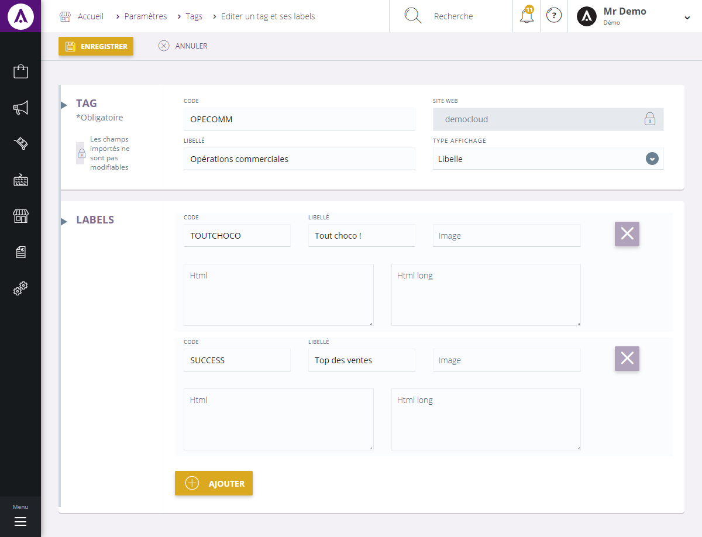
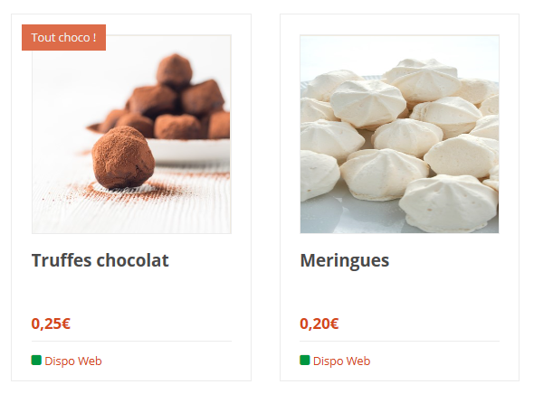

# Editer un tag

Ce formulaire vous permet de cr&eacute;er un tag et ses diff&eacute;rents labels.&nbsp;

Pour acc&egrave;der &agrave; ce formulaire, il vous suffit de cliquer sur la commande d'action dans la liste puis sur "Nouveau Tag".

Les informations suivantes sont obligatoires pour pouvoir cr&eacute;er un tag :

<ul>
<li>Le code</li>
<li>Le libell&eacute;</li>
<li>Le type d'affichage</li>
<li>Le site e-commerce associ&eacute; au tag.</li>
</ul>

Le type d'affichage est &agrave; choisir parmi :

<ul>
<li><strong>Libell&eacute;</strong> : le tag sera affich&eacute; par un simple texte dans la page</li>
<li><strong>Image</strong> : le tag sera affich&eacute; sous forme d'une image</li>
<li><strong>Html</strong> : l'html saisi sera ajout&eacute; dans la page</li>
</ul>

Lorsque vous avez renseign&eacute; les informations du tags, vous devez cr&eacute;er un ou plusieurs labels qui seront les&nbsp;&eacute;l&eacute;ments affich&eacute;s dans les descentes produits et/ou dans les fiches.

Par exemple, les&nbsp;labels cr&eacute;&eacute;s ci-dessus permettent d'afficher la descente suivante :&nbsp;

Pour chaque label vous devez saisir :

<ul>
<li>Son code</li>
<li>l'une des trois valeurs (libell&eacute;, html, image), en fonction du type d'affichage pr&eacute;vu.</li>
</ul>

