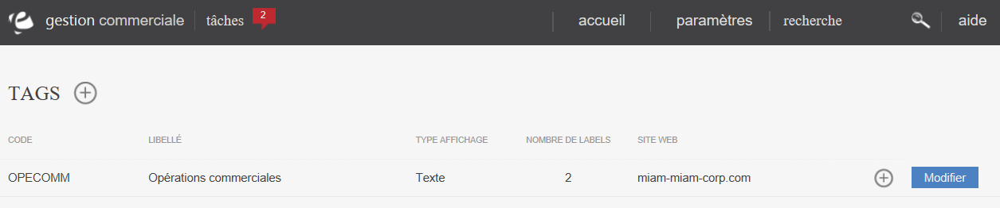

# Liste des tags

Vous pouvez placer des tags sur vos articles pour mettre en avant certaines de leur priorit&eacute;s. Un tag est un emplacement dans lequel vous pouvez placer une valeur &agrave; choisir dans une liste. Ces valeurs sont appel&eacute;s des "Labels" et ce seront ces&nbsp;&eacute;l&eacute;ments qui s'afficheront dans la recherche ou dans la fiche produit.

Cette page vous permet de visualiser tous les tags pouvant appara&icirc;tre sur vos produits.

Vous pouvez voir dans cette liste :

<ul>
<li>Le code du tag (pour int&eacute;gration dans votre site e-commerce)</li>
<li>Son libell&eacute;</li>
<li>Le type d'affichage qui sera utilis&eacute; pour repr&eacute;senter votre tag sur le site e-commerce</li>
<li>Le nombre de labels</li>
<li>Le site e-commerce associ&eacute; au tag.</li>
</ul>

Vous serez&nbsp;aussi en mesure de&nbsp;supprimer un tag via le menu d'action se trouvant sur la droite de celui-ci.

<h2>ACTIONS</h2>

La commande d'action&nbsp;que vous pouvez apercevoir pr&egrave;s du titre, correspond au menu de commande.

Il vous&nbsp;permet d'acc&eacute;der &agrave; diff&eacute;rentes actions qui vous permettront de g&eacute;rer vos tags.

<em>Exemple</em> de commande dont vous pouvez disposer :

<table>
<tbody>
<tr>
<td><a href="/fr-fr/office/settings/ECommerce/tags/edit.aspx">Cr&eacute;er un tag</a></td>
<td>Cette action vous permet de cr&eacute;er un nouvel attribut personnalis&eacute;.</td>
</tr>
</tbody>
</table>

