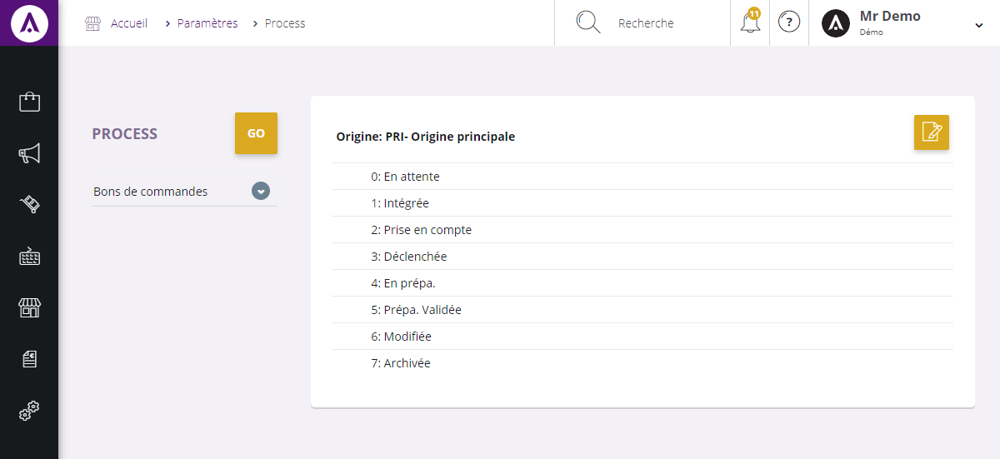
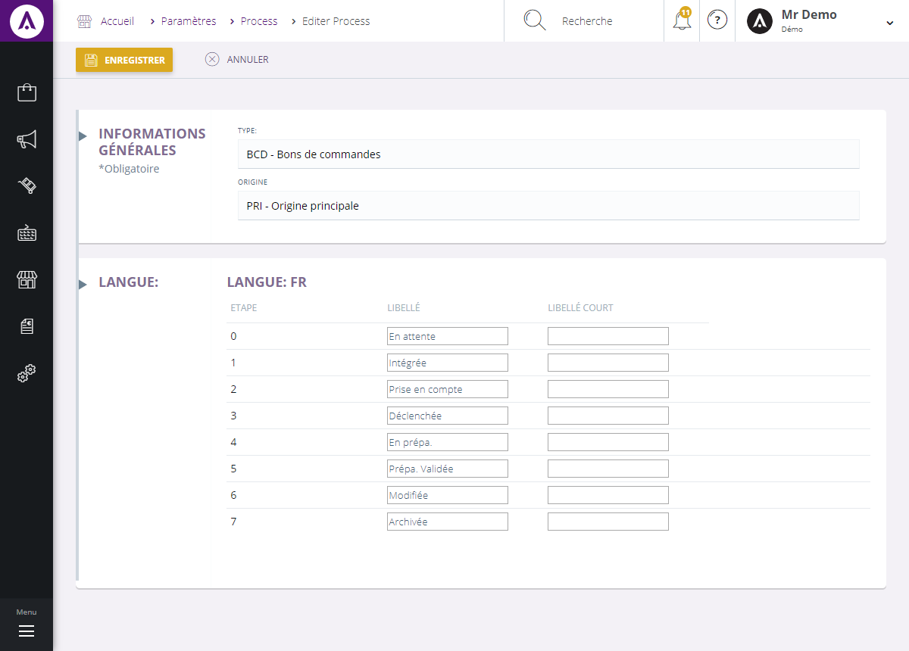
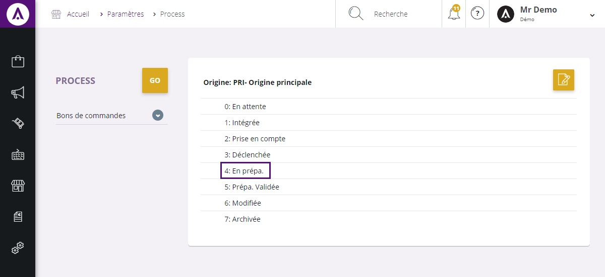

# Rails

## Libellés rails

Les libellés de rails sont les noms des différentes étapes d'un process et peuvent être modifiés dans l'outil de gestion.

Cette page vous permet de visualiser l'ensemble des libellés affichés par type de rails et par origines.

Pour chaque origine, vous pouvez modifier les libellés indépendamment des autres en cliquant sur le bouton "**Modifier**".

La page d'édition vous permet de changer les noms des différents libellés et de leur attribuer un nom simplifié pour certains affichages.

Les termes des libellés appliqués par défaut sont affichés en masque dans les zones de saisie.

Vous pouvez également modifier les libellés dans d'autre langue, pour cela il vous suffit de sélectionner la langue voulue et de cliquer sur le bouton "**Ajouter**". 

Pour finaliser vos modifications, cliquez sur "**Enregistrer**". _(Les libellés modifiés seront enregistré dans la table 'sysparams_libellesrails')_

Une fois enregistrés, les nouveaux libellés sont affiché à la place de ceux par défaut.
