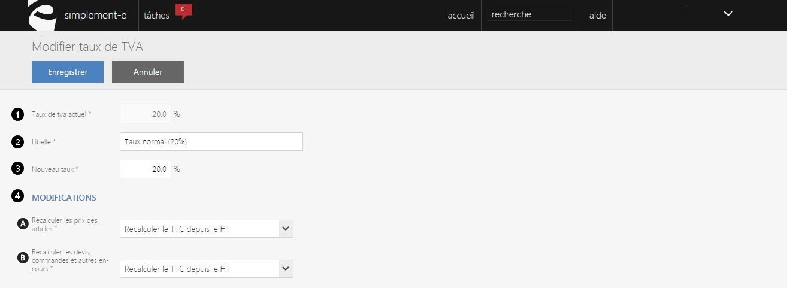

# Modifier un taux de TVA

Ce **formulaire** vous permet de **modifier les taux de TVA**.

Pour accéder à celui-ci, il vous suffit de cliquer sur le bouton bleu "**Modifier**".

Dans cette page, vous pourrez modifier les informations des TVA.

Vous pouvez voir dans ce formulaire :

1.  **Le taux de TVA actuellement mis en pratique** (20%, 10%...),
2.  Le **libellé** de la TVA (taux normal, taux réduit...),
3.  Le **taux que vous souhaitez instaurer**.

Il existe plusieurs possibilité de modification d'un taux : (4)

**A. Recalculer les prix des articles,**

Pour cette possibilité de modifications de TVA, deux choix s'offrent à vous :

- **Recalculer le TTC depuis le HT** provoque un changement tarifaire à la fois pour les consommateurs ainsi que pour les distributeurs.

- **Recalculer le HT depuis le TTC** provoque un changement tarifaire uniquement pour les consommateurs, le prix HT lui restera inchanger.

**B. Recalculer les devis, commandes et autres en-cours,**

Pour les devis, les commandes et autres en-cours fait avant la modification de la TVA, le prix TTC de toutes les affaires en cours de traitement sera **modifier** et **corriger** avec le **nouveaux taux**.

Lorsque vous aurez terminer vos modifications, cliquez sur le bouton bleu "**Enregistrer**".