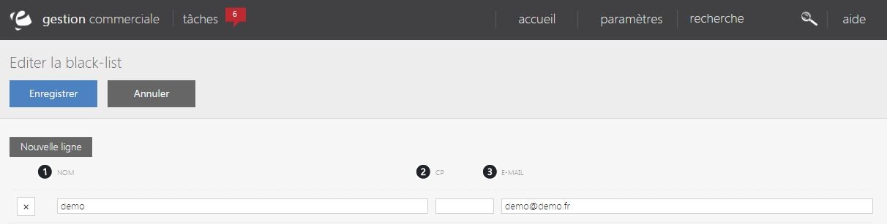

# Votre black-list

La <strong>black-list est un fichier rassemblant un ensemble de nom, adresse mail</strong>... <strong>consid&eacute;r&eacute; comme risqu&eacute;</strong> du fait d'un probl&egrave;me survenu sur une commande (impay&eacute;..).

Cette page vous permet de visualiser l'ensemble de ses adresses.

Vous pouvez voir dans cette page :

<ol>
<li>

Le nom de l'individu &agrave; risque,

</li>
<li>

Son code postal,

</li>
<li>

Son adresse mail.

</li>
</ol>

Vous pouvez modifier &agrave; tout moment votre black-list en cliquant sur une ligne afin de modifier les indormations d'un individu &agrave; risque.

<blockquote>

A savoir : vous pouvez supprimer une ligne en cliquant sur la croix &agrave; sa gauche, toute commande li&eacute; &agrave; un nom de cette liste sera bloqu&eacute;.

</blockquote>

Pour ajouter un nouveau individu &agrave; risque, cliquez sur "<strong>Nouvelle ligne</strong>".

Pour terminer l'ajout d'un nouveau individu risqu&eacute; &agrave; votre black-list, cliquez sur "<strong>Enregistrer</strong>".

&nbsp;

