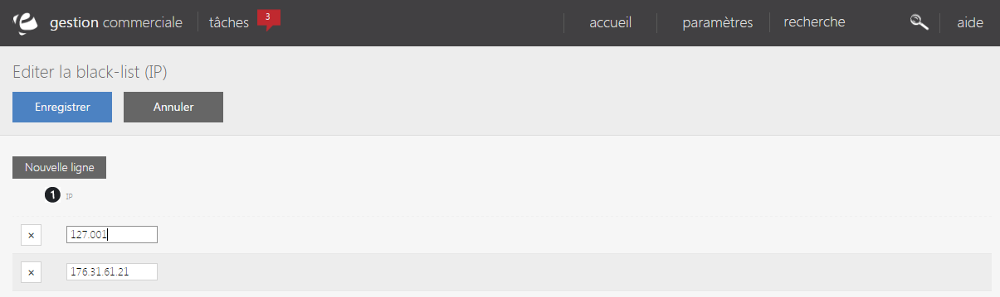

# Votre black-list IP

La <strong>black-list est un fichier rassemblant un ensemble d'adresse IP&nbsp;consid&eacute;r&eacute; comme risqu&eacute;</strong> du fait d'un probl&egrave;me survenu sur une commande (impay&eacute;..).

Cette page vous permet de visualiser l'ensemble de ses adresses.

Vous pouvez voir dans cette page :

<ol>
<li>Son adresse IP</li>
</ol>

Vous pouvez modifier &agrave; tout moment votre black-list en cliquant sur une ligne afin de modifier l'adresse IP&nbsp;d'un individu &agrave; risque.

<blockquote>

A savoir : vous pouvez supprimer l'adresse IP d'un individu en cliquant sur la croix &agrave; sa gauche

</blockquote>

Pour ajouter une nouvelle adresse &agrave; risque, cliquez sur "<strong>Nouvelle ligne</strong>".

Pour terminer l'ajout, cliquez sur "<strong>Enregistrer</strong>".

