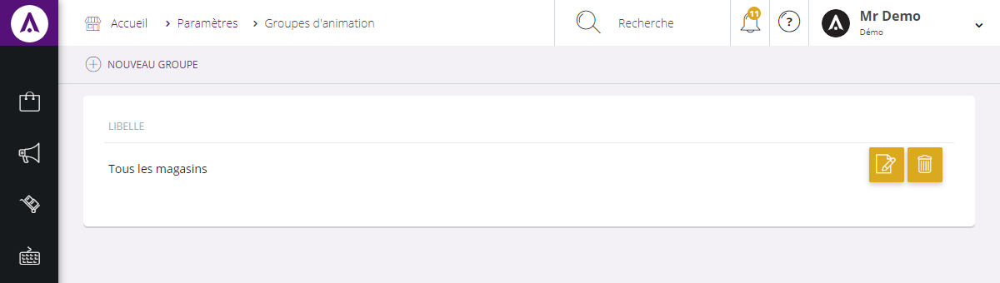
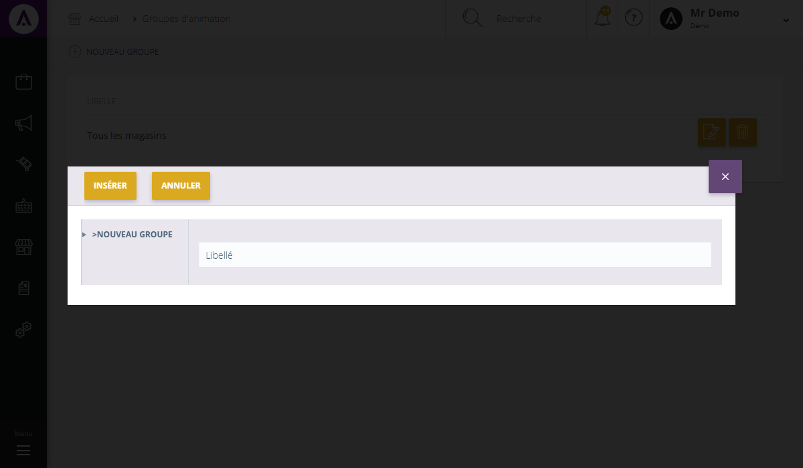

# Vos groupes d'animations

L'&eacute;cran de configuration des <strong>groupes d'animations</strong> vous permet de d&eacute;finir des <strong>cibles</strong> (ensemble de magasin..) <strong>re&ccedil;evant une m&ecirc;me op&eacute;ration commerciale</strong>.

De cette page, vous pouvez trouver l'ensemble de vos groupes d'animations cr&eacute;&eacute;s.

Vous pouvez voir :

<ol>
<li>Le libell&eacute; du groupe d'animation,</li>
<li>Bouton permettant de modifier un groupe,</li>
<li>Bouton de suppression.</li>
</ol>

En cliquant sur "<strong>Edit</strong>", un pop-up apparaitra avec une zone vous permettant de modifier le libell&eacute; du groupe d'animation.

<h3>Action</h3>

La&nbsp;<strong>commande d'action</strong>&nbsp;que vous pouvez apercevoir pr&egrave;s du titre, correspond au menu de commande. Il vous&nbsp;permet d'acc&eacute;der &agrave; diff&eacute;rentes actions qui vous permettront de g&eacute;rer vos articles.

<em>Exemple</em> de commande dont vous pouvez disposer :

<table>
<tbody>
<tr>
<td><strong>Nouveau groupe&nbsp;</strong></td>
<td>&nbsp;Cette action vous permet de cr&eacute;er un nouveau groupe d'animation</td>
</tr>
</tbody>
</table>

<h3>Nouveau groupe</h3>

Ce <strong>pop-up</strong> vous permet de <strong>cr&eacute;er un nouveau groupe d'animation</strong>.

Pour acc&eacute;der &agrave; ce pop-up, vous devez cliquer sur le <strong>menu d'action&nbsp;&gt; Nouveau groupe</strong>.

Afin de cr&eacute;er votre nouveau groupe d'animation, il vous suffit de rentrer le <strong>libell&eacute;</strong> que vous souhaitez lui donner puis cliquez sur "<strong>Ins&eacute;rer</strong>".

Lorsque vous aurez cliqu&eacute;s sur "<strong>Ins&eacute;rer</strong>", le nouveau groupe se joindra aux autres d&eacute;j&agrave; cr&eacute;&eacute;s.

