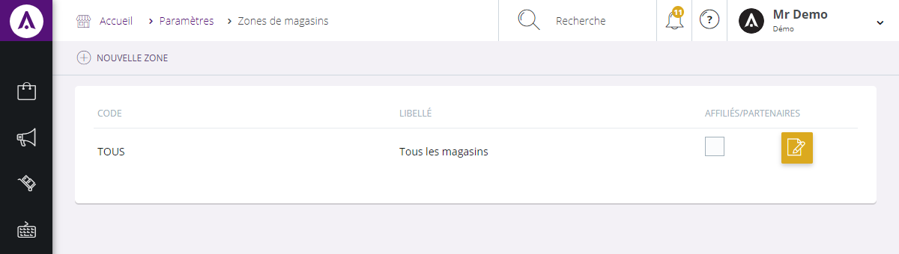

# Vos zones

L'écran de configuration des zones de magasins vous permet de **créer un découpage administratif des magasins** et **de visualiser l'ensemble des points de vente répartit selon leur zone** (département, responsable...).

Vous pouvez voir :

1.  Le code de la zone,
2.  Son libellé,
3.  Une case permettant de savoir si la zone est un partenaire commercial.

En cliquant sur "**Edit**", un pop-up apparaitra afin de modifier les informations de la zone.

### Action

La **commande d'action** que vous pouvez apercevoir près du titre, correspond au menu de commande.  
Il vous permet d'accéder à différentes actions qui vous permettront de gérer vos articles.

<table>

<tbody>

<tr>

<td>**Nouvelle zone**</td>

<td> Cette action vous permet de créer une nouvelle zone de magasin</td>

</tr>

</tbody>

</table>

### Nouvelle zone

Ce **pop-up** vous permet de créer un nouvelle zone de magasin.

Pour accéder à ce pop-up, vous devez cliquer sur le **menu d'action** **> Nouvelle zone**.

Afin de créer votre nouvelle zone, il vous suffit de rentrer les informations suivantes :

1.  Le libellé que vous souhaitez lui donner,
2.  Son code,
3.  Son pays de résidence,
4.  Cocher la case pour définir la zone comme partenaire ou affiliés.

Lorsque vous aurez cliqués sur "**Insérer**", la nouvelle zone se joindra aux autres déjà créés.