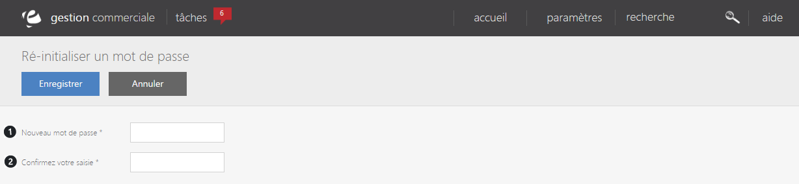

# Réinitialiser le mot de passe

Cette page vous permet de **modifier le mot de passe d'un utilisateur**.

Pour accéder à ce formulaire, il vous suffit de cliquez sur le **menu d'action** **>RE-INIT MOT DE PASSE.**

Vous verrez :

1.  Emplacement pour **saisir votre nouveau mot de passe**,
2.  **Confirmation de ce mot de passe**.

Lorsque vous aurez terminer la saisie de votre nouveau mot de passe, cliquez sur **Enregistrer**.