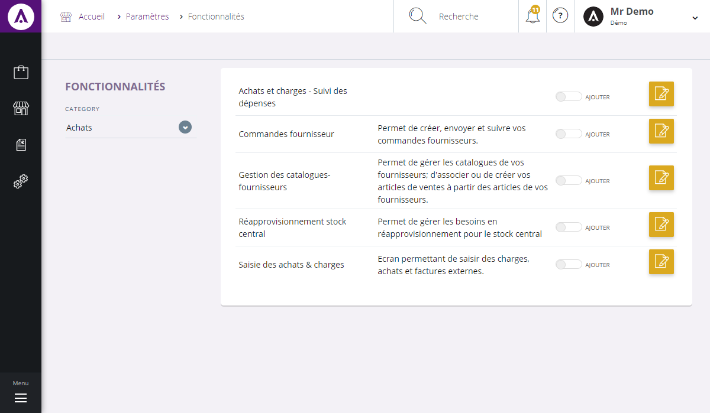
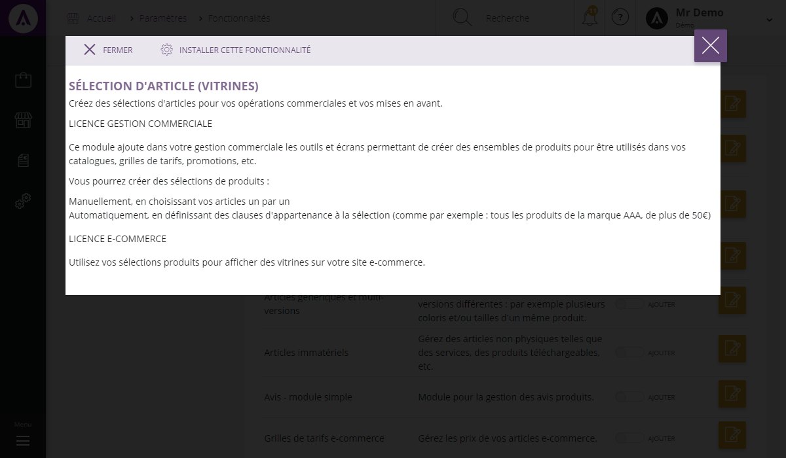

# Fonctionnalités

Cet écran de configuration vous permet de **paramétrer les différentes fonctionnalités de la gestion commerciale**.

Dans cette page, vous pouvez voir :

1.  Listes des **fonctionnalités** de la gestion commerciale (Achats, catalogue, commercial, communications...).
2.  Les **différents modules** d'une fonctionnalités,
3.  Commande permettant **l'installation** ou la **désactivation d'un module**.

> A savoir : désactiver un module ne le supprime pas, les données seront conservés.

Pour accéder aux informations détaillés d'un module, cliquez sur le bouton bleu "**Détails**", un pop-up s'affichera et vous expliquera le rôle et le fonctionnement d'un module.

