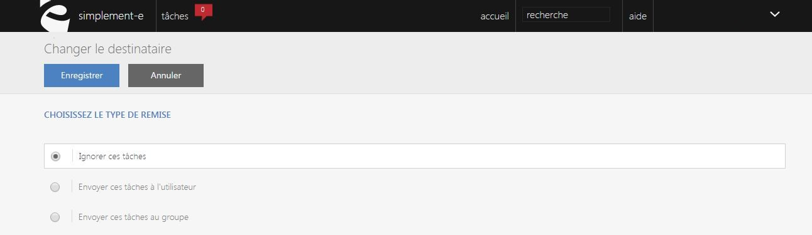
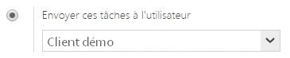
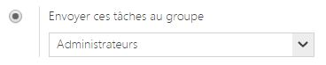

# Modifier un destinataire

Cette page vous permet de <strong>modifier les crit&egrave;res de la t&acirc;che et de son destinataire</strong>.

Dans cette page, vous pouvez modifier une t&acirc;che via les informations suivant :

- <strong>Ignorer la t&acirc;che</strong>, en choisissant ce crit&egrave;re la t&acirc;che sera supprimer.

- <strong>Envoyer la t&acirc;che &agrave; un utilisateur</strong>, permet d'envoyer la t&acirc;che &agrave; un utilisateur pr&eacute;cis en rentrant son nom et son adresse mail.

&nbsp;

- <strong>Envoyer la t&acirc;che &agrave; un groupe</strong> vous permet d'envoyer une t&acirc;che &agrave; un groupe d'utilisateur.

