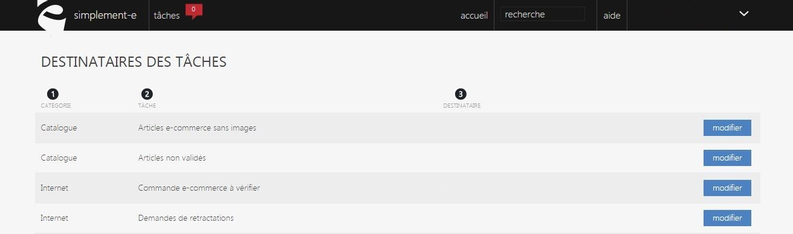

# Destinataires des tâches

L'écran de configuration des **destinataires des tâches** vous permet de paramètrer l'envoi automatiques de tâches à certains utilisateurs ou groupe d'utilisateur.

De cette page, vous pouvez voir :

1.  La catégorie à laquelle les tâches appartiennent (catalogue, internet...),
2.  Le libellé des tâches,
3.  Le destinataire pour qui la tâche a été créé.

 Pour modifier une tâche, cliquez sur le bouton bleu "[Modifier](/fr-fr/office/settings/T%C3%A2ches/todos/changetodo.html)".