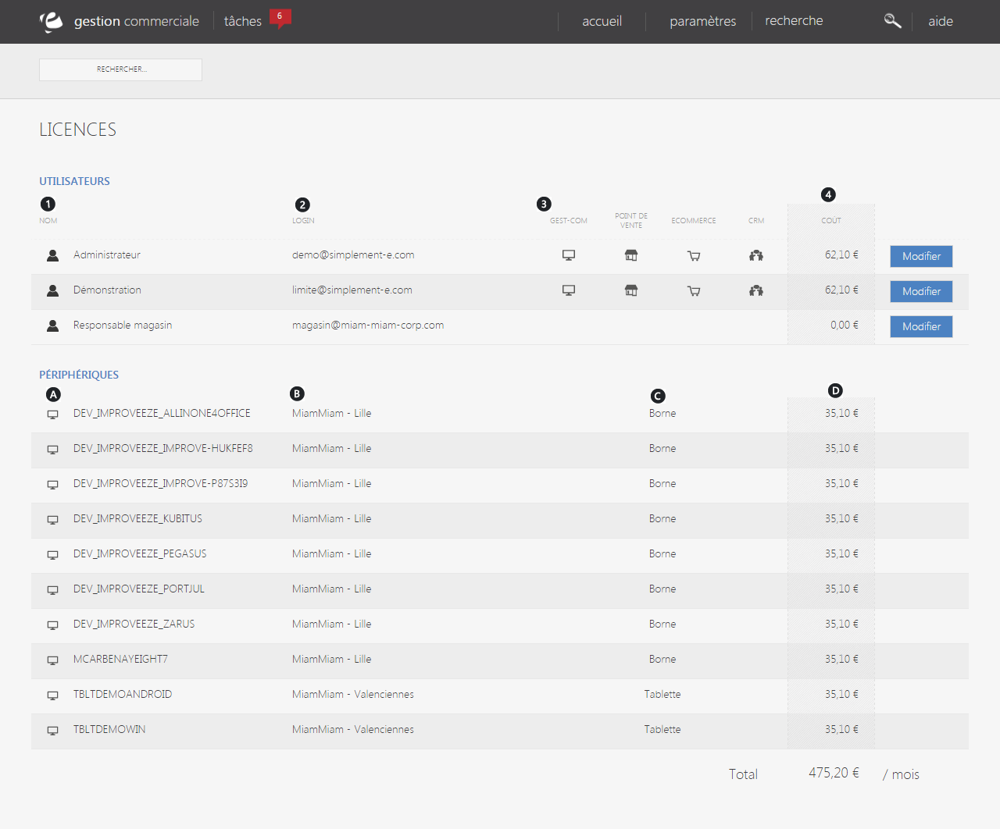

# Licences

Cet &eacute;cran de configuration vous permet de&nbsp;<strong>visualiser la liste des utilisateurs&nbsp;</strong>et&nbsp;<strong>p&eacute;riph&eacute;riques,&nbsp;payant une&nbsp;</strong>ou&nbsp;<strong>plusieurs licences</strong>.

<blockquote>

A savoir : vous ne pouvez modifier que les utilisateurs, les p&eacute;riph&eacute;riques ne sont pas modifiables

</blockquote>
<h3>UTILISATEURS</h3>

Cette page vous donne acc&egrave;s aux&nbsp;<strong>utilisateurs poss&eacute;dant un acc&egrave;s payant&nbsp;</strong>et vous permet de&nbsp;<strong>g&eacute;rer leurs licences</strong>.

Vous pouvez voir :

<ol>
<li>Le nom de l'utilisateur,</li>
<li>Son identifiant,</li>
<li>Les licences (payantes) qu'il d&eacute;tient,</li>
<li>Le co&ucirc;t de ses licences.</li>
</ol>

Pour modifier les droits d'un utilisateur, cliquez sur le bouton bleu "<strong>Modifier</strong>", vous serez redirig&eacute; vers la page de&nbsp;<a href="/app/settings/VotreEntreprise/utilisateursdroitsautorisations/EditUser.aspx">modification d'un utilisateur</a>.

<h3>P&Eacute;RIPH&Eacute;RIQUES</h3>

Cet &eacute;cran vous permet aussi d'acc&eacute;der aux&nbsp;<strong>p&eacute;riph&eacute;riques</strong>.

Chaque p&eacute;riph&eacute;rique (borne, tablette...)&nbsp;<strong>poss&egrave;de un acc&egrave;s payant</strong>, vous pouvez voir dans cet &eacute;cran :

<ol type="a">
<li>Le nom du p&eacute;riph&eacute;rique,</li>
<li>Son emplacement (lille, valenciennes...),</li>
<li>Son type de licence (borne, tablette...),</li>
<li>Son co&ucirc;t.</li>
</ol>
<blockquote>

A savoir : il est impossible de modifier un p&eacute;riph&eacute;rique &nbsp;

</blockquote>

