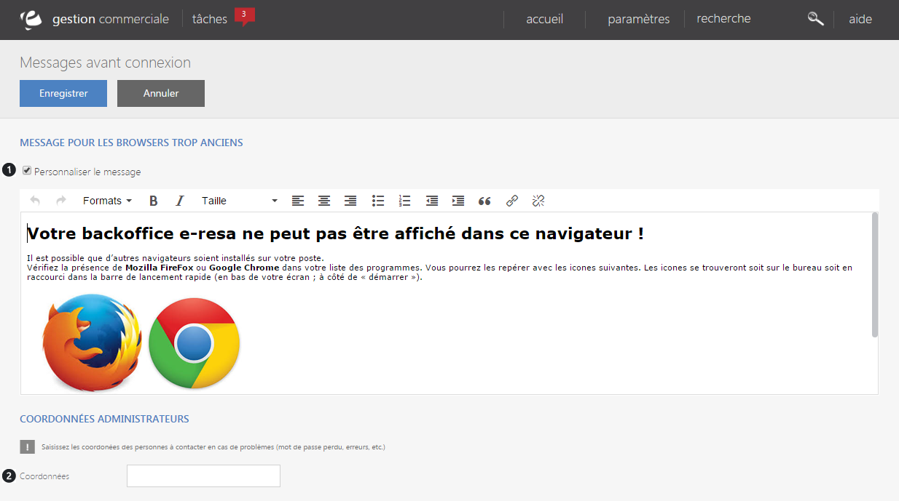

# Message

Cet &eacute;cran de configuration vous permet de <strong>g&eacute;rer le message qui apparait lorsqu'un browser est trop ancien</strong>.

Il vous est possible de personnaliser le message via la case "<strong>Personnaliser le message</strong>" (1) et ainsi acc&eacute;der &agrave; la zone de texte vous permettant de modifier le contenu.

Vous pouvez saisir les <strong>coordonn&eacute;es des personnes &agrave; contacter en cas de probl&egrave;mes</strong> (mot de passe perdu...), pour cela, vous devez rentrer les identifiants de la personne (e-mail...) dans le bloc "<strong>Coordonn&eacute;es</strong>". (2)

