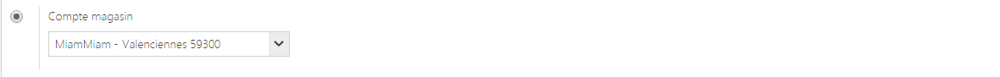

# Modifier un utilisateur

Ce formulaire vous permet de **modifier les informations d'un utilisateur**.

Pour accéder à ce formulaire, il vous suffit de cliquer sur "**Modifier**" dans le **menu d'action.**

Vous pouvez voir dans ce formulaire :

1.  Le **nom** de l'utilisateur,
2.  Son **adresse mail**,
3.  Son **mot de passe**,
4.  S'il est **membre d'un group**e (groupe administrateur, groupe commerciaux),
5.  Son **type de compte** :

- Compte **utilisateur standard**,

- Compte **utilisateur sans licence,**

- Compte **magasin**, similaire à un utilisateur standard mais lié à un magasin, c'est à dire qu'il ne verra que les informations de son magasin.

- Compte **désactivé**.

     6.  Ses **licences** :

- **Gestion commerciale**, licence permettant l'accès une gestion commerciale.

- **Points de vente**, licence qui permet l'accès aux différents points de vente.

- **E-commerce**, droit qui permet l'accès au site e-commerce.

- **CRM** (Customers Relation Management), permet d'accéder à la relation client.

Pour **ajouter une licence**, il vous suffit de **cocher une case** ou de **décocher si vous souhaitez en enlever une**.

> A savoir : changer l'adresse mail oblige la modification du mot de passe