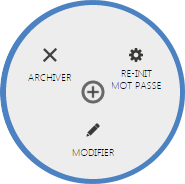

# Interaction utilisateur

L'interaction utilisateur correspond aux différentes parties permettant de **gérer les informations d'un utilisateur**.

En cliquant sur le **menu d'action** à droite d'un utilisateur, vous aurez accès aux thémes ci-dessous.