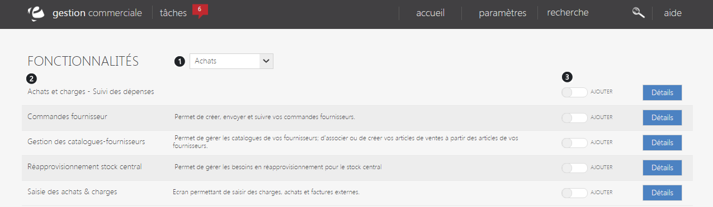
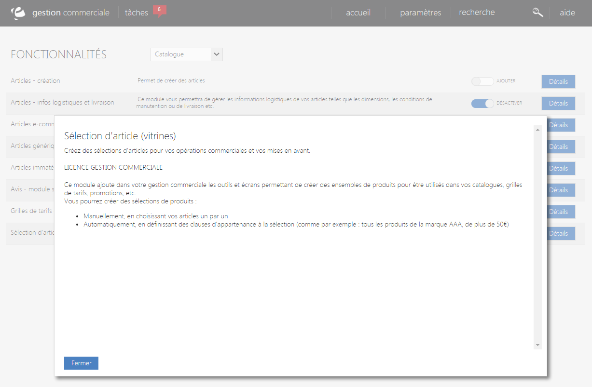

# Fonctionnalités

Cet &eacute;cran de configuration vous permet de <strong>param&eacute;trer les diff&eacute;rentes fonctionnalit&eacute;s de la gestion commerciale</strong>.

Dans cette page, vous pouvez voir :

<ol>
<li>Listes des <strong>fonctionnalit&eacute;s</strong> de la gestion commerciale (Achats, catalogue, commercial, communications...).</li>
<li>Les <strong>diff&eacute;rents modules</strong> d'une fonctionnalit&eacute;s,</li>
<li>Commande permettant <strong>l'installation</strong> ou la <strong>d&eacute;sactivation d'un module</strong>.</li>
</ol>
<blockquote>

A savoir : d&eacute;sactiver un module ne le supprime pas, les donn&eacute;es seront conserv&eacute;s.

</blockquote>

Pour acc&eacute;der aux informations d&eacute;taill&eacute;s d'un module, cliquez sur le bouton bleu "<strong>D&eacute;tails</strong>", un pop-up s'affichera et vous expliquera le r&ocirc;le et le fonctionnement d'un module.

