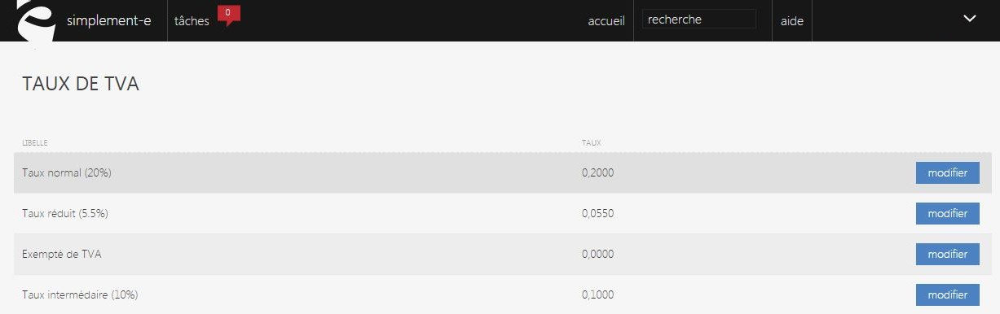

# Taux de TVA

Cette page vous permet de <strong>visualiser et de modifier vos diff&eacute;rents taux de TVA</strong>.

Le montant d'un taux de TVA est proportionnel aux prix de vente hors taxe, il existe diff&eacute;rents taux de TVA selon le secteur d'activit&eacute; :

- <strong>Normal : 20%</strong>

<strong>- Interm&eacute;diaire : 10%</strong>

<strong>- R&eacute;duit : 5.5%</strong>

<strong>- Super r&eacute;duit : 2.1%</strong>

Vous pouvez modifier les TVA via le bouton bleu que vous pouvez apercevoir sur la droite pour cela, cliquez sur "<strong>Modifier</strong>".

