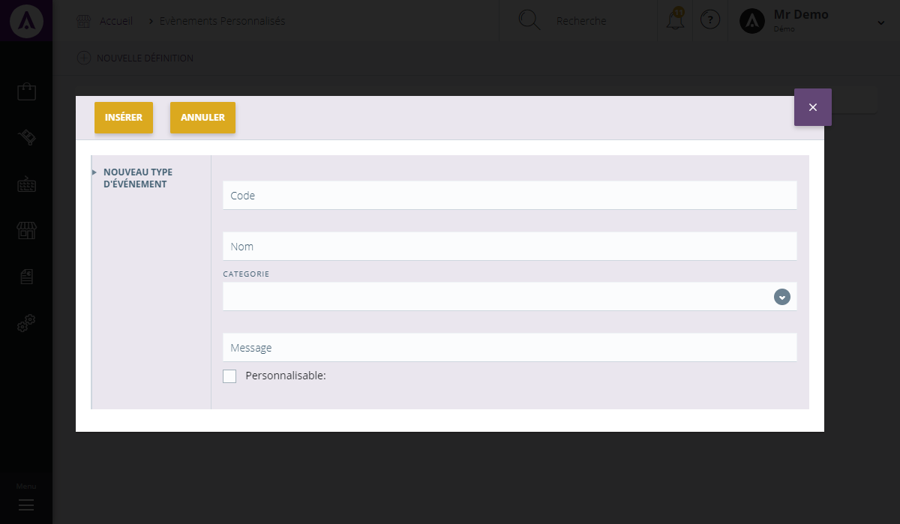

# Evénements personnalisés

L'&eacute;cran de configuration des&nbsp;<strong>&eacute;v&eacute;nements personnalis&eacute;s vous permet de g&eacute;rer vos diff&eacute;rentes action &eacute;v&eacute;nementielle</strong>.

Dans cette page, vous trouverez l'ensemble de vos &eacute;v&eacute;nements cr&eacute;&eacute;s.

Vous pouvez voir :

<ol>
<li>Le <strong>code</strong> de l'&eacute;v&eacute;nement,</li>
<li>Son <strong>nom</strong>,</li>
<li>Sa <strong>cat&eacute;gorie</strong> (catalogue, relation client, achat...),</li>
<li>Le <strong>message</strong> r&eacute;sum&eacute;,</li>
<li>Case pr&eacute;cisant si <strong>l'&eacute;v&eacute;nement est personnalisable ou non</strong>.</li>
</ol>

En cliquant sur "<strong>Edit</strong>", vous aurez la possibilit&eacute; de modifier un &eacute;v&eacute;nement.

Pour supprimer un &eacute;v&eacute;nement, cliquez sur "<strong>Delete</strong>".

<h3>ACTION</h3>

La commande d'action<strong>&nbsp;</strong>que vous pouvez apercevoir pr&egrave;s du titre, correspond au menu de commande. Il vous&nbsp;permet d'acc&eacute;der &agrave; diff&eacute;rentes actions qui vous permettront de g&eacute;rer vos articles.

<em>Exemple&nbsp;</em>de commande dont vous pouvez disposer :

<table>
<tbody>
<tr>
<td><strong>Nouvelle d&eacute;finition&nbsp;</strong></td>
<td>&nbsp;Cette action vous permet de cr&eacute;er un nouveau type d'&eacute;v&eacute;nement&nbsp;</td>
</tr>
</tbody>
</table>
<h3>Nouveau type d'&eacute;v&eacute;nement</h3>

Ce&nbsp;pop-up&nbsp;vous permet de&nbsp;<strong>cr&eacute;er un nouveau type d'&eacute;v&eacute;nement</strong>.

Pour acc&eacute;der &agrave; ce pop-up, vous devez cliquer sur le <strong>menu d'action&nbsp;&gt;Nouvelle d&eacute;finition</strong>.

Afin de cr&eacute;er votre nouvel &eacute;v&eacute;nement, remplissez les donn&eacute;es suivantes :

<ol>
<li>Le <strong>code</strong> du nouveau &eacute;v&eacute;nement,</li>
<li>Son <strong>nom</strong>,</li>
<li>Sa <strong>cat&eacute;gorie</strong>,</li>
<li>Son <strong>message</strong>,</li>
<li>Le fait qu'il soit <strong>personnalisable ou non</strong>.</li>
</ol>

Pour terminer votre cr&eacute;ation, cliquez sur "<strong>Ins&eacute;rer</strong>", le nouveau groupe se joindra aux autres d&eacute;j&agrave; cr&eacute;&eacute;s.

