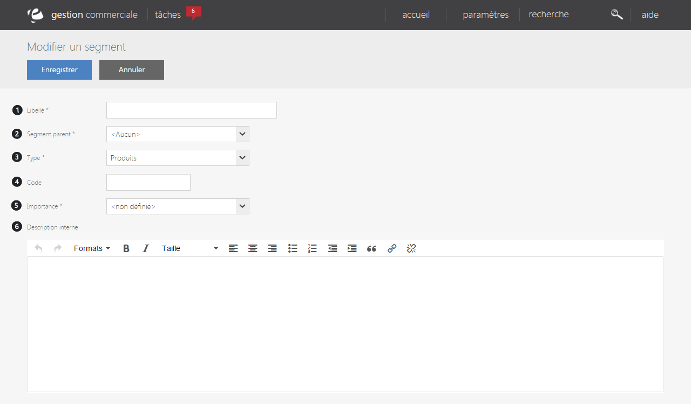
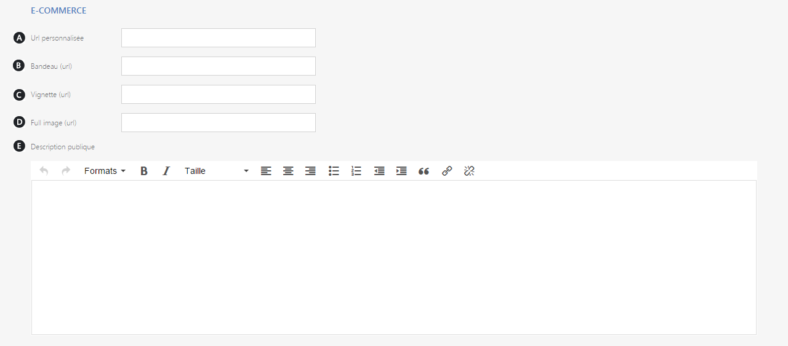

# Créer ou modifier

Ce formulaire vous permet de <strong>cr&eacute;er</strong> ou de <strong>modifier</strong> une <strong>segmentation produits</strong>.

<h3>Informations interne</h3>

Vous pourrez <strong>cr&eacute;er</strong> ou <strong>modifier</strong> un <strong>segment</strong> via les informations suivantes :

<ol>
<li>Le <strong>libell&eacute;</strong> que vous souhaitez donner au segment,</li>
<li>Le <strong>segment parent</strong> (par exemple: caramels pour le segment confiseries),</li>
<li>Son <strong>type</strong> :</li>
</ol>

- <strong>Produits</strong>, correspond &agrave; votre cat&eacute;gories principales. Les produits plac&eacute;s dans ce type de segmentation seront affich&eacute;s dans les descentes produits sur votre site e-commerce, bornes, etc.

- <strong>Produits secondaires</strong> :&nbsp;repr&eacute;sente des cat&eacute;gories secondaires, dont les produits ne seront visibles qu'en compl&eacute;ment d'un produit plac&eacute; dans une cat&eacute;gorie "Produits"

- <strong>Compl&eacute;ment</strong>, repr&eacute;sente toutes les cat&eacute;gories de produits qui ne seront pas visible directement au client.

&nbsp;&nbsp;&nbsp;&nbsp;&nbsp;4.&nbsp; Son <strong>code</strong>,

&nbsp;&nbsp;&nbsp;&nbsp;&nbsp;5.&nbsp; Son <strong>importance</strong> dans le catalogue (normale, mise en avant ou segment star),

&nbsp;&nbsp;&nbsp;&nbsp; 6.&nbsp; <strong>Description interne</strong> du segment.

Ces donn&eacute;es vous permettront de remplir les informations de&nbsp;la <strong>partie interne</strong> du segment.

<blockquote>

Si vous souhaitez cacher toute un segment de produits de votre site e-commerce ou de vos bornes, modifiez le type de celui-ci pour "Produits secondaires" ou "Compl&eacute;ments"

</blockquote>
<h3>Informations publique</h3>

Ces informations seront quant &agrave; elle <strong>visible par la client&egrave;le</strong>, ils pourront y voir :

<ol type="a">
<li><strong>L'URL personnalis&eacute;e</strong></li>
<li>Le <strong>bandeau</strong> (image en t&ecirc;te de page),</li>
<li>La <strong>vignette</strong> (petite image),</li>
<li><strong>L'image principale,</strong></li>
<li>Une <strong>description</strong> du produit.</li>
</ol>

Apr&egrave;s avoir terminer, cliquez sur <strong>Enregistrer</strong> afin de valider votre <strong>cr&eacute;ation</strong> ou la <strong>modification</strong>.

