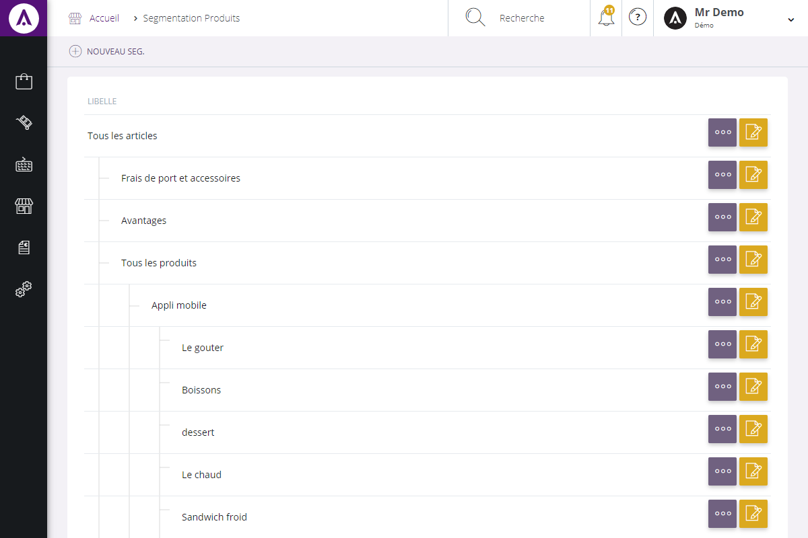

# Vos segments produits

Cet &eacute;cran de configuration vous permet de <strong>segmenter les cat&eacute;gories de produits visibles aux clients</strong>.

Vous retrouverez l'ensemble des cat&eacute;gories de produits vous permettant de segmenter (fractionner) votre catalogue.

Vous pouvez voir :

<ol>
<li>Le libell&eacute; des cat&eacute;gories de produits,</li>
<li>Menu d'action vous permettant de cr&eacute;er un nouveau segment d'apr&egrave;s une cat&eacute;gorie,</li>
</ol>

En cliquant sur "<strong>D&eacute;tails</strong>" (3), vous aurez acc&egrave;s aux <strong>informations</strong> de la cat&eacute;gorie et vous serez en mesure de les <strong>modifier</strong>.

<h3>ACTION</h3>

La&nbsp;<strong>commande d'action&nbsp;</strong>que vous pouvez apercevoir pr&egrave;s du titre, correspond au menu de commande. Il vous&nbsp;permet d'acc&eacute;der &agrave; diff&eacute;rentes actions qui vous permettront de g&eacute;rer vos segments.

<em>Exemple&nbsp;</em>de commande dont vous pouvez disposer :

<table>
<tbody>
<tr>
<td><strong><a href="/fr-fr/office/settings/catalogue/Segmentation/edit.aspx">Nouveau segment</a> </strong></td>
<td>&nbsp;Cette action vous permet de cr&eacute;er un nouveau segment</td>
</tr>
</tbody>
</table>

