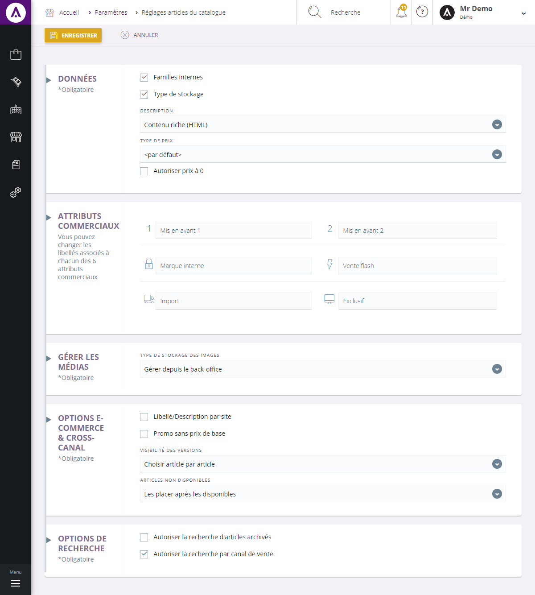

# Options générales

L'écran de configuration des options catalogue vous permet de **gérer les différentes données liés à votre catalogue**, tels que :

- Les **données**,
- Les **attributs commerciaux**,
- Les **options e-commerce**,

- Etc...

Ce formulaire vous permet donc de gérer les options de votre catalogue, vous pouvez voir :

### Les données :

1.  **Case** permettant de savoir si un **produit est interne**,
2.  **Case** permettant d'afficher les **différents type de stockage**,
3.  Type de **description d'un article** (contenu riche, contenu simple),
4.  Type de **prix,** défini la façon de saisie des prix, il sert à bloquer ou modifier certains prix.
5.  **Case** permettant **l'autorisation d'un prix égal à** **0**,

### Attributs commerciaux :

      6.  **Personnification des attributs commerciaux**, vous pouvez changer les libellés associés à chacun des attributs commerciaux.

_Exemple d'un attribut apparissant sur un site e-commerce :_  
 

### Options e-commerce & cross-canal

Cette partie du formulaire permettent de modifier les données e-commerce et cross-canal, vous pouvez voir :

1.  Case permettant une description par site,
2.  Case qui permet d'afficher la promo sans divulguer le prix de base,
3.  Les différentes visibilité des versions :

    - Choix article par article,
    - Afficher les référence génériques,
    - Afficher les références enfants.

d. L'affichage des articles non-disponible.

### Options de recherche

Ces données vous permettent de gérer les différentes autorisations de recherche :

     e. Case autorisant la recherche d'article archivés,

     f. Case qui vous permet d'autoriser la recherche par un canal de vente.

En cliquant sur **Enregistrer**, les modifications se feront directement auprès de votre gestion commerciale.