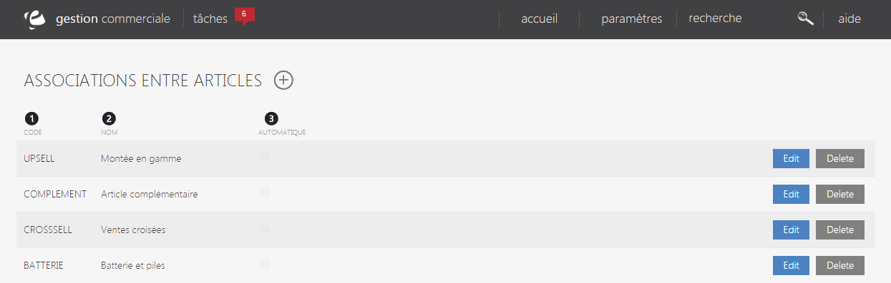
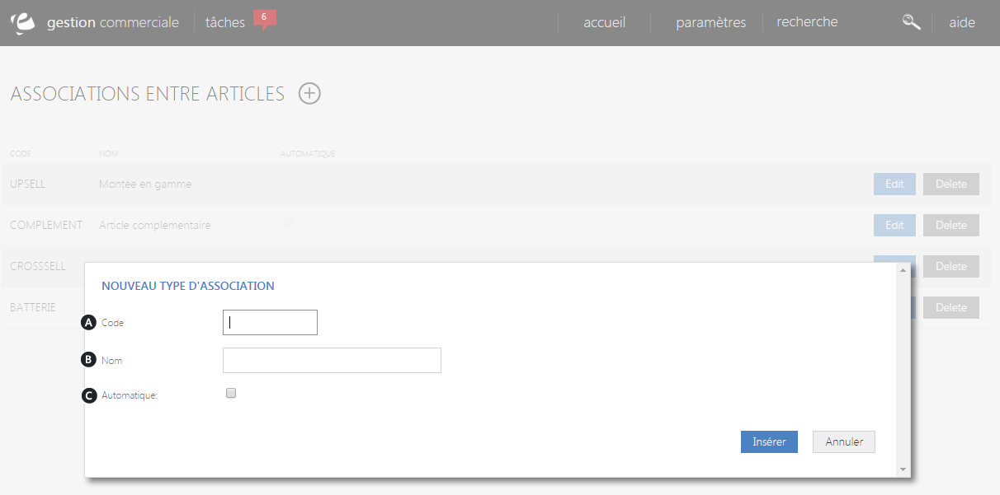

# Vos associations

L'&eacute;cran de configuration des&nbsp;types d'associations entre articles vous permet de&nbsp;<strong>visualiser et g&eacute;rer les diff&eacute;rentes suggestions entre produits</strong>, tels que :

- <strong>Upsell</strong>, qui correspond &agrave; la mont&eacute;e en gamme.

- <strong>Cross-selling</strong>, qui correspond aux ventes crois&eacute;s.

- <strong>Compl&eacute;mentaire</strong>, qui correspond aux articles compl&eacute;mentaires.

Dans cette page, vous trouverez&nbsp;<strong>l'ensemble de vos types d'unions entre produits.</strong>

Vous pouvez voir :

<ol>
<li>Le <strong>code</strong> du type,</li>
<li>Son <strong>nom</strong>,</li>
<li>Case permettant de trouver <strong>automatiquement le type d'association</strong>.</li>
</ol>

En cliquant sur "<strong>Edit</strong>", vous aurez la possibilit&eacute; de changer les donn&eacute;es de votre type d'association article.

Pour supprimer une cat&eacute;gorie, cliquez sur "<strong>Delete</strong>".

<h3>ACTION</h3>

La&nbsp;<strong>commande d'action&nbsp;</strong>que vous pouvez apercevoir pr&egrave;s du titre, correspond au menu de commande. Il vous&nbsp;permet d'acc&eacute;der &agrave; diff&eacute;rentes actions qui vous permettront de g&eacute;rer vos articles.

<em>Exemple&nbsp;</em>de commande dont vous pouvez disposer :

<table>
<tbody>
<tr>
<td><strong>Nouveau type&nbsp;</strong></td>
<td>&nbsp;Cette action permet de cr&eacute;er un nouveau type d'association&nbsp;</td>
</tr>
</tbody>
</table>
<h3>Nouveau type</h3>

Ce&nbsp;pop-up&nbsp;vous permet de&nbsp;<strong>cr&eacute;er un nouveau type d'association entre article</strong>.

Pour acc&eacute;der &agrave; ce pop-up, vous devez cliquer sur le <strong>menu d'action</strong>&nbsp;<strong>&gt;Nouveau type</strong>.

Afin de cr&eacute;er votre nouvelle cat&eacute;gorie, remplissez les donn&eacute;es suivantes :

<ol type="a">
<li>Le <strong>code</strong> du nouveau type,</li>
<li>Son <strong>nom</strong>,</li>
<li>La case permettant de <strong>trouver automatiquement le type d'association ad&eacute;quat</strong>.</li>
</ol>

Pour terminer votre cr&eacute;ation, cliquez sur "<strong>Ins&eacute;rer</strong>", le nouveau type se joindra aux autres d&eacute;j&agrave; cr&eacute;&eacute;s.

&nbsp;

