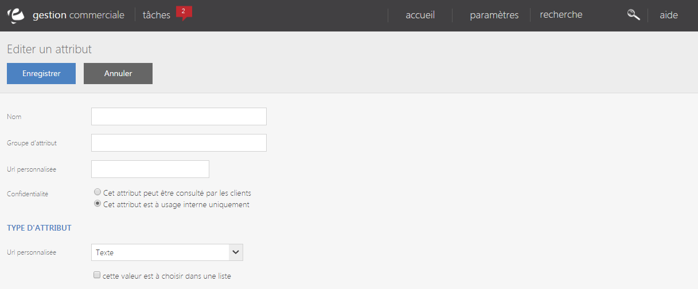

# Nouvel attribut

Ce formulaire vous permet de <strong>cr&eacute;er&nbsp;un attribut personnalis&eacute;</strong>.

Pour acc&eacute;der &agrave; ce formulaire, il vous suffit de cliquer sur la commande d'action puis sur "<strong>Nouvel attribut</strong>".

Vous devez <strong>saisir&nbsp;les informations suivantes</strong> afin de cr&eacute;er un nouvel attribut :

<ul>
<li>Le nom de l'attribut,</li>
<li>S'il appartient &agrave; un groupe,</li>
<li>Son URL personnalis&eacute;e,</li>
<li>La confidentialit&eacute; de l'attribut (public ou interne),</li>
<li>Son type d'attribut.</li>
</ul>

&nbsp;Pour terminer votre modification, cliquez sur <strong>Enregistrer</strong>.

