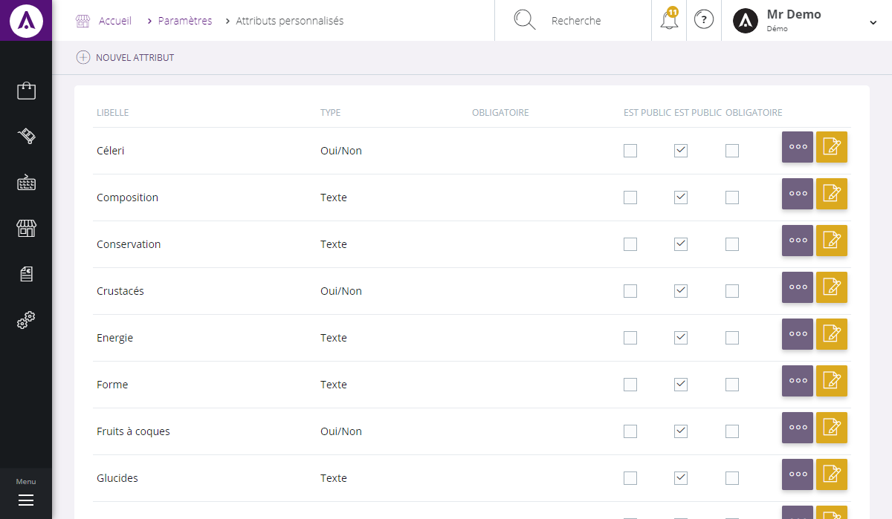

# Vos attributs personnalisés

Cette page vous permet de visualiser tout les <strong>attributs&nbsp;apparaissant dans votre catalogue produit</strong>.

Vous pouvez voir dans cette page :

<ul>
<li>Le libell&eacute; de l'attribut,</li>
<li>Son type d'URL (num&eacute;rique, texte, entier...),</li>
<li>Son groupe s'il appartient &agrave; un groupe,</li>
<li>Une listes de crit&egrave;res &agrave; cocher (public, obligatoire...).</li>
</ul>

Vous serez&nbsp;aussi en mesure de&nbsp;<strong>supprimer</strong> un attributs de vos param&egrave;tres via le menu d'action se trouvant sur la droite de celui-ci.

Pour avoir plus d'information sur l'attribut, cliquez sur le bouton bleu "<strong>d&eacute;tails</strong>".

<h3>ACTIONS</h3>

La commande d'action&nbsp;que vous pouvez apercevoir pr&egrave;s du titre, correspond au menu de commande. Il vous&nbsp;permet d'acc&eacute;der &agrave; diff&eacute;rentes actions qui vous permettront de g&eacute;rer vos articles.

<em>Exemple</em> de commande dont vous pouvez disposer :

<table>
<tbody>
<tr>
<td><a href="/fr-fr/office/settings/catalogue/attributs/editattribut.aspx">Nouvel attribut</a></td>
<td>&nbsp;Cette action vous permet de cr&eacute;er un nouvel attribut personnalis&eacute;.</td>
</tr>
</tbody>
</table>

&nbsp;

