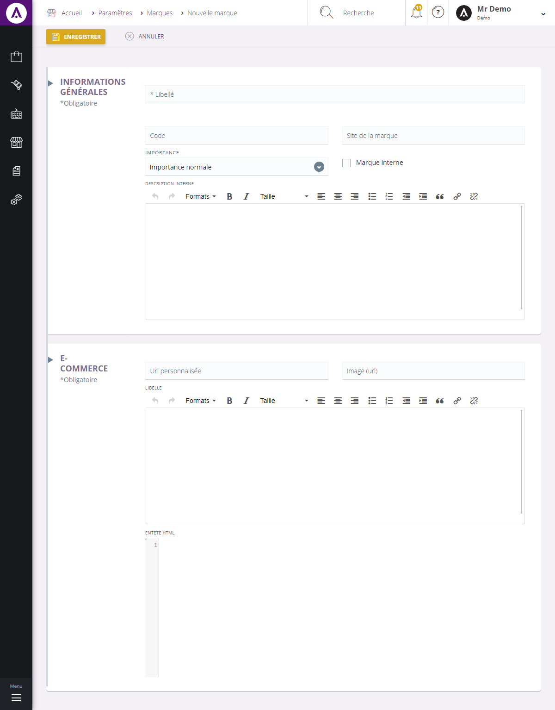

# Nouvelle marque

<h3>Information interne</h3>

Cette page vous permet de <strong>cr&eacute;er une nouvelle marque</strong> que vous pourrez ajouter &agrave; votre catalogue.

Pour acc&eacute;der &agrave; ce formulaire, vous devez cliquer sur le <strong>menu d'action</strong> <strong>&gt;Nouveau</strong>.

Pour cr&eacute;er une nouvelle marque, remplissez les informations&nbsp;suivantes :

<ol>
<li>Le libell&eacute; de cette marque,</li>
<li>Son code r&eacute;f&eacute;renciel,</li>
<li>Son site e-commerce,</li>
<li>Son importance dans votre catalogue (mise en avant, normal...),</li>
<li>Si c'est une marque interne (vous appartenant),</li>
<li>Une zone permettant de&nbsp;d&eacute;crire&nbsp;la marque.</li>
</ol>

<h3>Information publique</h3>

Les informations ci-dessous sont celle que le publique pourront apercevoir.

Vous pourrez remplir les <strong>crit&egrave;res e-commerce</strong> de la marque, comme :

<ol type="a">
<li>L'URL personnalis&eacute;e,</li>
<li>L'URL de l'image,</li>
<li>Une description publique de la marque.</li>
</ol>

Lorsque tout ces crit&egrave;res seront remplis, vous pourrez terminer votre cr&eacute;ation en cliquant sur <strong>Enregistrer</strong>.

&nbsp;

