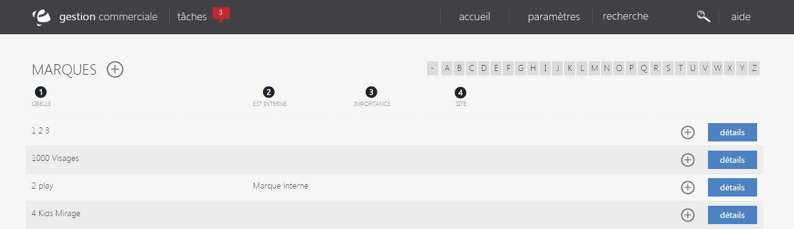

# Vos marques

Cette page vous permet de <strong>visualiser toute les marques apparaissant dans votre catalogue</strong>.

Sur le haut &agrave; droite de la page, vous pouvez apercevoir&nbsp;un <strong>mode de trie</strong>&nbsp;vous permettant de rechercher une marque selon sa premi&egrave;re lettre.

En cliquant sur l'une de ces lettres, toute les marques commen&ccedil;ant par celle-ci s'afficheront sur le milieu de la page.

Vous pouvez voir dans cette page :

<ol>
<li>&nbsp;&nbsp;&nbsp;Le libell&eacute; de la marque,</li>
<li>&nbsp;&nbsp;&nbsp;Marque interne ou non (vous appartenant ou venant d'un partenaire),</li>
<li>&nbsp;&nbsp;&nbsp;L'importance de la marque (mise en avant, normal..),</li>
<li>&nbsp;&nbsp;&nbsp;Le lien vers le site de la marque.</li>
</ol>

Vous serez&nbsp;aussi en mesure de&nbsp;<strong>supprimer</strong> une marque de vos param&egrave;tres via le menu d'action se trouvant sur la droite de celle-ci.

Pour avoir plus d'information sur la marque, cliquez sur le bouton bleu "<strong>d&eacute;tails</strong>".

<h3>Actions</h3>

La commande d'action&nbsp;que vous pouvez apercevoir pr&egrave;s du titre, correspond au menu de commande. Il vous&nbsp;permet d'acc&eacute;der &agrave; diff&eacute;rentes actions qui vous permettront de g&eacute;rer vos articles.

<em>Exemple</em> de commande dont vous pouvez disposer :

<table>
<tbody>
<tr>
<td><a title="Nouvelle marque" href="/fr-fr/office/settings/catalogue/marques/edit.html"><strong>Nouvelle marque</strong>&nbsp;</a></td>
<td>&nbsp;Cette action vous permet de cr&eacute;er une nouvelle marque qui apparaitra dans votre catalogue.</td>
</tr>
</tbody>
</table>

