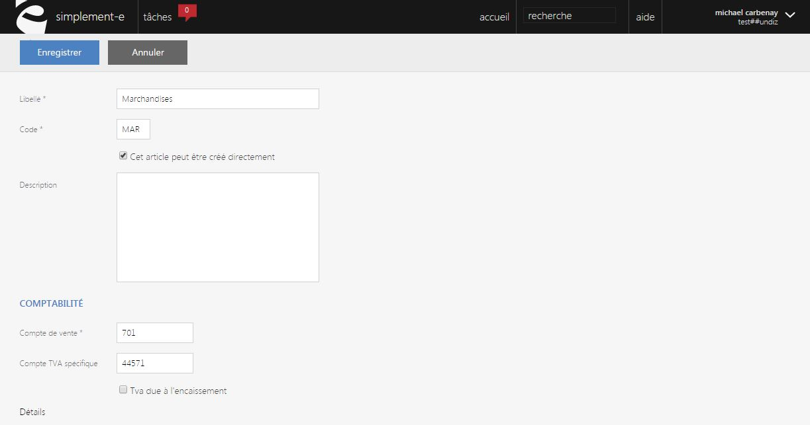

# Créer ou modifier

Ce formulaire vous permet de <strong>modifier un&nbsp;type article</strong>.

Pour acc&eacute;der &agrave; ce formulaire, il vous suffit de cliquer sur le bouton bleu "<strong>Modifier</strong>".

Dans ce formulaire, vous pourrez modifier les informations de votre article.

Vous pourrez voir les informations suivantes :

<ol>
<li>Le <strong>libell&eacute; du type d'article</strong> (le type d'article : marchandise, prestation...),</li>
<li>Son <strong>code r&eacute;f&eacute;renciel</strong>,</li>
<li>Case permettant de cr&eacute;er directement l'article ou non,</li>
<li>Zone de texte permettant de d&eacute;crire le type d'article,</li>
<li>Comptabilit&eacute; de votre article :</li>
</ol>

- <strong>Compte de vente,&nbsp;</strong>

<strong>- Compte de TVA sp&eacute;cifique,</strong>&nbsp;

Pour terminer votre modification, cliquez sur <strong>Enregistrer</strong>.

