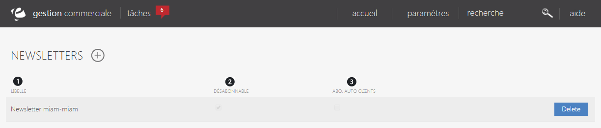
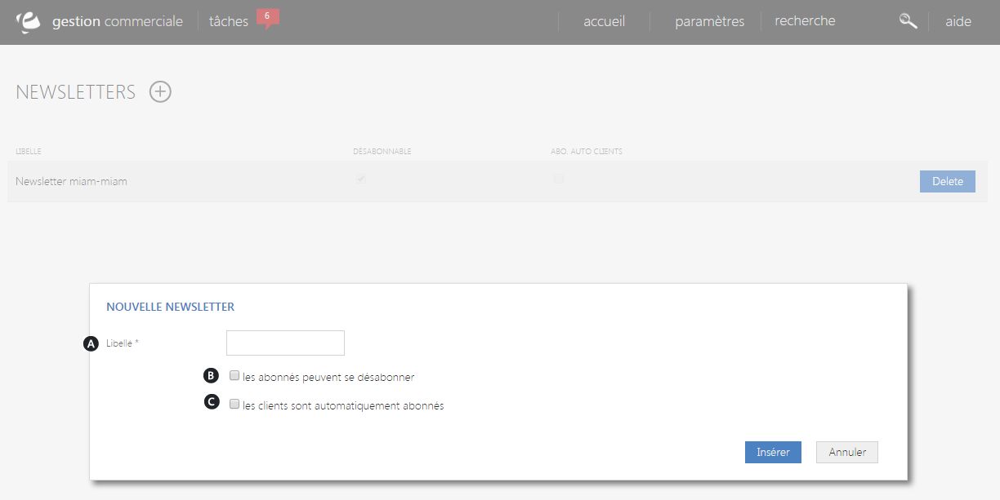

# Vos newsletters

L'&eacute;cran de configuration des newsletters&nbsp;vous permet de <strong>g&eacute;rer vos diff&eacute;rents bulletins d'information.</strong>

Dans cette page, vous trouverez <strong>l'ensemble de vos newsletters actives</strong>.

Vous pouvez voir :

<ol>
<li>Le <strong>libell&eacute;</strong> de la newsletter,</li>
<li>Une coche pr&eacute;cisant s'il est <strong>possible de se d&eacute;sabonner</strong>,</li>
<li>une coche&nbsp;d&eacute;finissant si <strong>l'abonnement est automatique&nbsp;pour les clients</strong>.</li>
</ol>
<blockquote>

Attention, ce principe d'opt-out actif ne peut &ecirc;tre utilis&eacute; que sous certaines conditions pr&eacute;cis&eacute;es dans l'article <a href="http://www.legifrance.gouv.fr/affichCodeArticle.do;jsessionid=CC4017ADEF5861BF009DFD5C31A036CF.tpdjo07v_3?idArticle=LEGIARTI000024506081&amp;cidTexte=LEGITEXT000006070987&amp;dateTexte=20120104" target="_blank">34-5 du code des postes et t&eacute;l&eacute;communications</a>

</blockquote>

Pour supprimer une newsletter, cliquez sur "<strong>Supprimer</strong>".

<h3>ACTION</h3>

La&nbsp;<strong>commande d'action&nbsp;</strong>que vous pouvez apercevoir pr&egrave;s du titre, correspond au menu de commande. Il vous&nbsp;permet d'acc&eacute;der &agrave; diff&eacute;rentes actions qui vous permettront de g&eacute;rer vos articles.

<em>Exemple&nbsp;</em>de commande dont vous pouvez disposer :

<table>
<tbody>
<tr>
<td><strong>Nouvelle newsletter&nbsp;</strong></td>
<td>&nbsp;Cette action permet de cr&eacute;er une nouvelle newsletter&nbsp;</td>
</tr>
</tbody>
</table>
<h3>Nouvelle newsletter</h3>

Ce&nbsp;pop-up&nbsp;vous permet de&nbsp;<strong>cr&eacute;er une nouvelle newsletter</strong>.

Pour acc&eacute;der &agrave; ce pop-up, vous devez cliquer sur le <strong>menu d'action</strong>&nbsp;<strong>&gt; Nouvelle newsletter</strong>.

Afin de cr&eacute;er votre nouvel &eacute;v&eacute;nement, remplissez les donn&eacute;es suivantes :

<ol type="a">
<li>Le <strong>libell&eacute;</strong> de la nouvelle newsletter,</li>
<li>D&eacute;cochez cette case si le <strong>d&eacute;sabonnement &agrave;&nbsp;cette newsletter ne peut &ecirc;tre r&eacute;alis&eacute;&nbsp;sur votre site</strong> (par exemple l'inscription &agrave; une newsletter d'un partenaire).</li>
<li>Cochez cette case si <strong>l'abonnement est automatique pour vos clients</strong></li>
</ol>

Pour terminer votre cr&eacute;ation, cliquez sur "<strong>Ins&eacute;rer</strong>", la nouvelle newsletter se joindra &agrave; celles d&eacute;j&agrave; cr&eacute;&eacute;es.

&nbsp;

