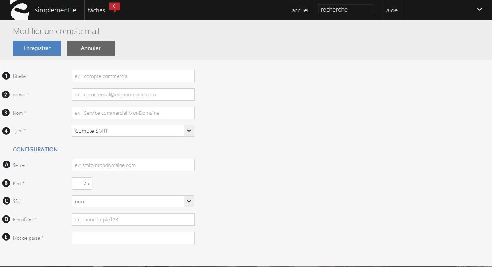

# Créer ou modifier un compte

Ce formulaire vous **permet de créer ou de modifier un compte mail**.

Vous pourrez **créer** ou **modifier** **un compte** via les informations suivantes :

1.  Le libellé du compte (compte SAV...),
2.  L'e-mail associé au compte,
3.  Le nom de l'envoyeur,
4.  Le type du compte (personnalisé...).

Ces informations vous permettront de remplir la partie générale du formulaire.

La partie **configuration **vous servira à vous connecter :

1.  Le nom du server de connexion,
2.  Le numéro de port de connexion (..),
3.  SSL, vous permet de crypter les données,
4.  L'identifiant de connexion,
5.  Le mot de passe.

> A savoir : la partie configuration est différentes selon le type (compte SMTP, Mailjet, etc.).

Après avoir terminer, cliquez sur **Enregistrer** afin de valider votre création ou modification.

 Pour connaitre toute ces informations, prenez contacte avec votre hébergeur mail.