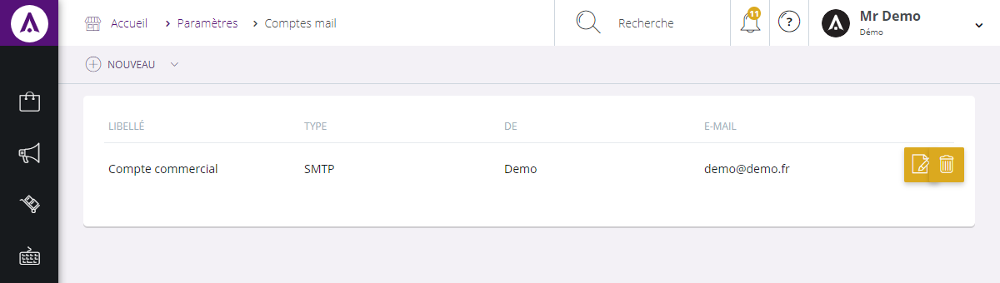

#  Vos comptes e-mails

L'&eacute;cran de configuration des<strong> comptes e-mails</strong> vous permet de <strong>param&eacute;trer la cr&eacute;ation et la visualisation d'e-mail re&ccedil;us ou envoy&eacute;s.</strong>

De cette page, vous pouvez visualiser l'ensemble de vos mails.

Vous pouvez voir :

<ol>
<li>Le libell&eacute; du compte mail,</li>
<li>Son type (Mailjet, SMTP..),</li>
<li>Son nom,</li>
<li>Son adresse mail.</li>
</ol>

Vous pouvez modifier un compte en cliquant sur le bouton bleu "<strong>Modifier</strong>", ou encore effacer un compte via "<strong>Supprimer</strong>".

<h3>ACTION</h3>

La&nbsp;<strong>commande d'action&nbsp;</strong>que vous pouvez apercevoir pr&egrave;s du titre, correspond au menu de commande. Il vous&nbsp;permet d'acc&eacute;der &agrave; diff&eacute;rentes actions qui vous permettront de g&eacute;rer vos articles.

<em>Exemple&nbsp;</em>de commande dont vous pouvez disposer :

<table>
<tbody>
<tr>
<td><strong>Nouveau&nbsp;</strong></td>
<td>&nbsp;Cette action vous&nbsp;permet de cr&eacute;er un nouveau compte e-mail&nbsp;</td>
</tr>
</tbody>
</table>

&nbsp;

