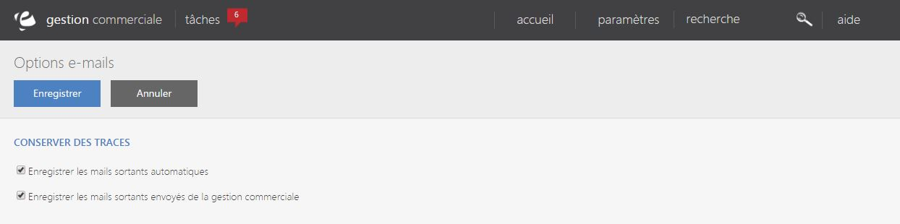

# Vos options

Cette page vous permet de **visualiser toutes les options liées à vos e-mails**.

Cet écran de configuration vous permet de **tracer des mails** en les enregistrants dans votre base de donnée.

Pour cela, vous disposez de deux critères de traçages :

- D'un **enregistrement des mails automatiques sortant**,

- D'un **enregistrement des mails sortant envoyés de votre gestion commerciale**.

Pour activer ces enregistrement, il vous suffit de **cocher les cases**.