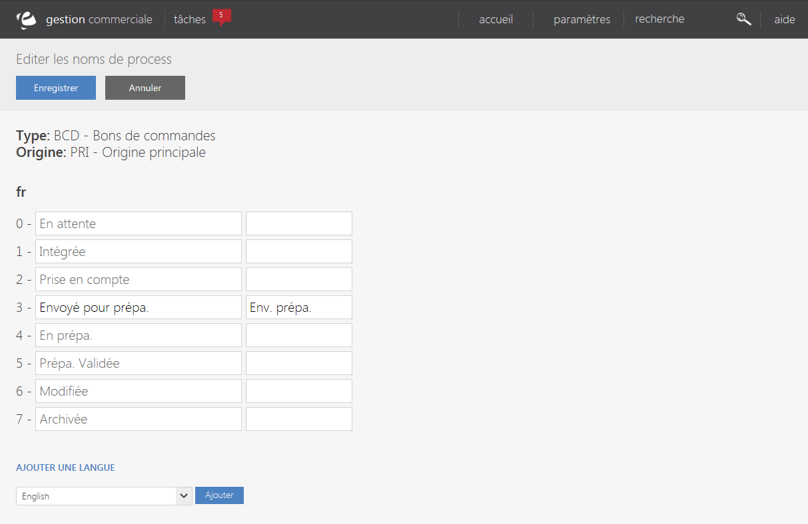
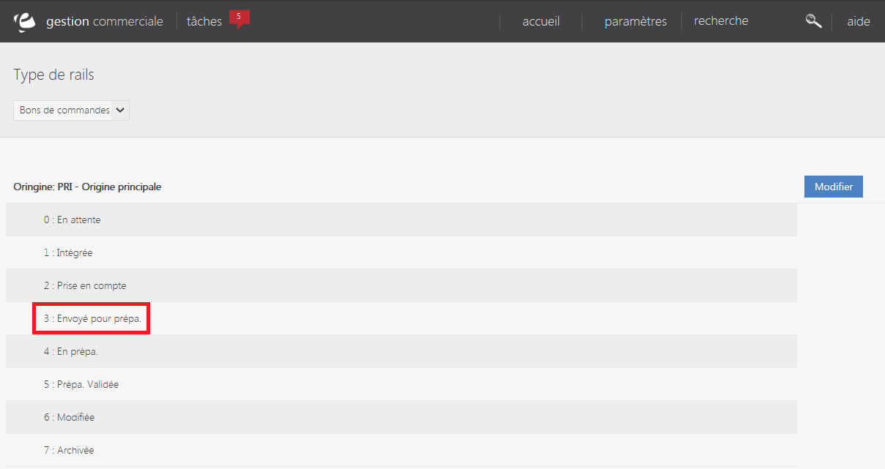

# Rails

<h2>Libell&eacute;s rails</h2>

Les libell&eacute;s de rails sont les noms des diff&eacute;rentes &eacute;tapes d'un process et peuvent &ecirc;tre modifi&eacute;s dans l'outil de gestion.

Cette page vous permet de visualiser l'ensemble des libell&eacute;s affich&eacute;s par type de rails et par origines.

Pour chaque origine, vous pouvez modifier les libell&eacute;s ind&eacute;pendamment des autres en cliquant sur le bouton "<strong>Modifier</strong>".

La page d'&eacute;dition vous permet de changer les noms des diff&eacute;rents libell&eacute;s et de leur attribuer un nom simplifi&eacute; pour certains affichages.

Les termes des libell&eacute;s appliqu&eacute;s par d&eacute;faut sont affich&eacute;s en masque&nbsp;dans les zones de saisie.

Vous pouvez &eacute;galement modifier les libell&eacute;s dans d'autre langue, pour cela il vous suffie de s&eacute;lectionner la langue voulue et de cliquer sur le bouton "<strong>Ajouter</strong>".&nbsp;

Pour finaliser vos modifications, cliquez sur "<strong>Enregistrer</strong>". <em>(Les libell&eacute;s modifi&eacute;s seront enregistr&eacute; dans la table 'sysparams_libellesrails')</em>

Une fois enregistr&eacute;, les nouveaux libell&eacute;s sont affich&eacute; &agrave; la place de ceux par defaut.

