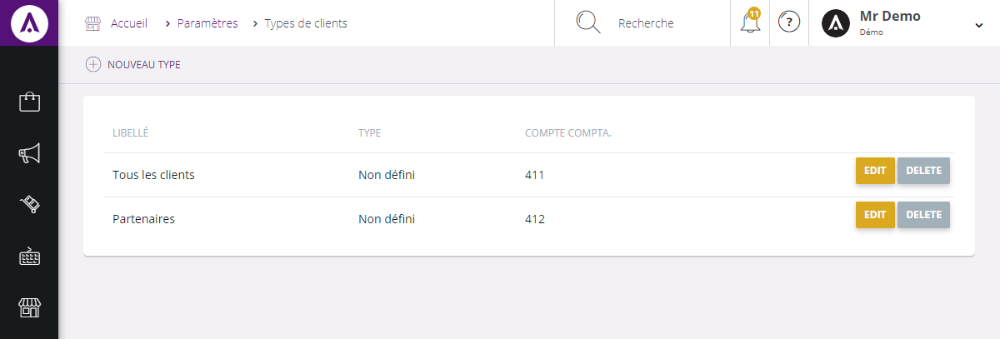
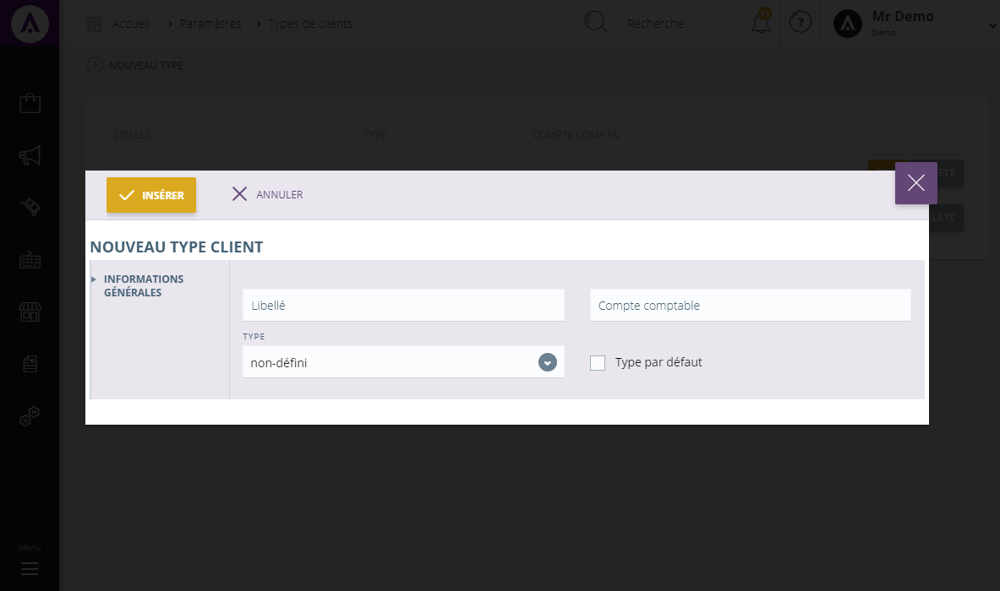

# Types de clients

L'&eacute;cran de configuration des&nbsp;types de clients vous permet de <strong>visualiser et g&eacute;rer les diff&eacute;rents types de clients que vous pouvez avoir</strong> (client web, magasin, partenaire...).

Dans cette page, vous trouverez <strong>l'ensemble de vos types de clients</strong>.

Vous pouvez voir :

<ol>
<li>Le <strong>libell&eacute;</strong> du type de client,</li>
<li>Son <strong>type</strong> (particulier, professionnel...),</li>
<li>Son <strong>code comptable</strong>.</li>
</ol>

En cliquant sur "<strong>Modifier</strong>", vous aurez la possibilit&eacute; de changer les donn&eacute;es de votre type de client.

Pour supprimer une cat&eacute;gorie, cliquez sur "<strong>Supprimer</strong>".

<h3>ACTION</h3>

La&nbsp;<strong>commande d'action&nbsp;</strong>que vous pouvez apercevoir pr&egrave;s du titre, correspond au menu de commande. Il vous&nbsp;permet d'acc&eacute;der &agrave; diff&eacute;rentes actions qui vous permettront de g&eacute;rer vos articles.

<em>Exemple&nbsp;</em>de commande dont vous pouvez disposer :

<table>
<tbody>
<tr>
<td><strong>Nouveau type&nbsp;</strong></td>
<td>

&nbsp;Cette action vous permet de cr&eacute;er un nouveau type de client&nbsp;

</td>
</tr>
</tbody>
</table>
<h3>Nouveau type</h3>

Ce&nbsp;pop-up&nbsp;vous permet de&nbsp;<strong>cr&eacute;er un nouveau type de client</strong>.

Pour acc&eacute;der &agrave; ce pop-up, vous devez cliquer sur le <strong>menu d'action</strong>&nbsp;<strong>&gt; Nouveau type</strong>.

Afin de cr&eacute;er votre nouvelle cat&eacute;gorie, remplissez les donn&eacute;es suivantes :

<ol>
<li>Le <strong>libell&eacute;</strong> du nouveau type de client,</li>
<li>Son <strong>code comptable</strong>,</li>
<li>Son <strong>type</strong> (particulier, professionnel...),</li>
<li>La <strong>case type par d&eacute;faut</strong>.</li>
</ol>

Pour terminer votre cr&eacute;ation, cliquez sur "<strong>Ins&eacute;rer</strong>", le nouveau client&nbsp;se joindra aux autres d&eacute;j&agrave; cr&eacute;&eacute;s.

&nbsp;

