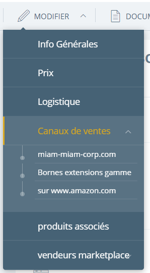

# Gestion des disponibilités

## Sources des produits

### Stocks centraux

> [!Note]
> Si vous faites appel à un e-logisticien ou à un service de préparation intra-groupe, vous pouvez opter au choix entre le mode _drop shipping_ et le mode _stocks centraux_ en fonction de vos besoins. 
> 
> Une fois le mode choisi, il est assez complexe d'en changer, n'hésitez pas à solliciter notre équipe pour vous conseiller.

### Stocks Magasins

Si vous n'utilisez pas nous outils pour la gestion de vos magasins, vous pouvez facilement importer vos stocks magasins via EDI, en suivant [le format de fichier des imports de stocks](../administration/edi/logistique/stockstocks.md).

### Drop shipping

### Fabrication

## Disponibilités par canaux

Activez la _gestion des disponibilités par canaux_ pour pouvoir définir des règles différentes en fonction du canal utilisé pour réaliser la vente. Vous pouvez par exemple :
- Définir des seuils de visibilités distincts en e-commerce et en extension de gamme sur bornes
- N'envoyer qu'une partie de votre stock dans les informations de disponibilités pour une marketplace
- Effectuer une réservation de stock destinée à un canal de vente particulier.

## Gérer la disponibilité par canal

Pour définir les seuils de disponibilités et de visibilité d'un canal spécifique, il vous suffit d'ouvrir le dossier article de l'article souhaité dans _Altazion Office_, puis de cliquer sur **Modifier** > **Canaux de ventes** et choisir le canal à modifier.

Vous pourrez ensuite, en fonction du canal, modifier les seuils :

- de _disponibilité_ : si la quantité disponible passe sous ce seuil, le produit sera marqué comme "Non disponible"
- de _dépublication_ : en dessous de ce seuil, l'article est automatiquement dépublié (et donc rendu totalement invisible) du canal

Vous pourrez aussi modifier d'autres seuils dans cette même page :

- de _maximum commandable_ : ce seuil permet de définir le quantité maximale achetable en une seule commande. En fonction du paramétrage du module, cela peut s'étendre au maximum commandable par période pour un seul et même client.
- de _pré-commande_ : si vous proposez la possibilité de réaliser des pré-commandes, ce seuil vous permet de définir la quantité maximale que vous pouvez proposer avant la date de sortie définie. Une fois ce seuil dépassé, le produit sera "Non disponible" jusqu'à la date de sortie, puis suivra les seuils "normaux".

## Intégrations

=> EDI
=> interne
=> via Hub (prendre exemple retail reload)
