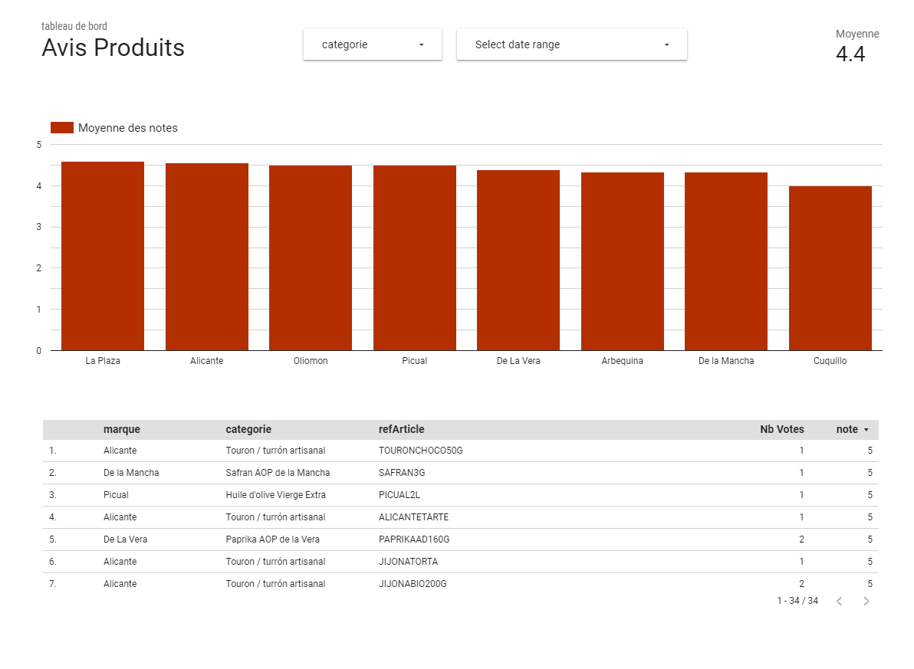

# Version 20.0 - 12 Janvier 2020

## [BETA] Intégration Google DataStudio

## Autres modifs et bug-fixes

- ISSUE 13308 : La zone de recherche générale ne fonctionne pas si le texte cherché commence ou se termine par un espace.
- ISSUE 13174 : La tâche sur des horaires non renseignés pour un magasin peut être dupliquée si le magasin ne les saisit par rapidement après apparition de la première tâche.
- STORY 13108 : L'application android ouvre les liens https://app.simplement-e.com et https://offfice.altazion.com