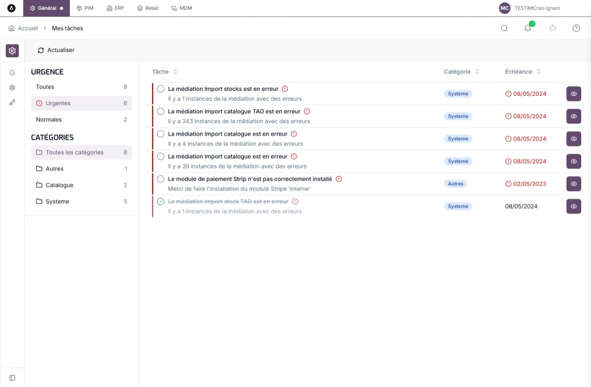
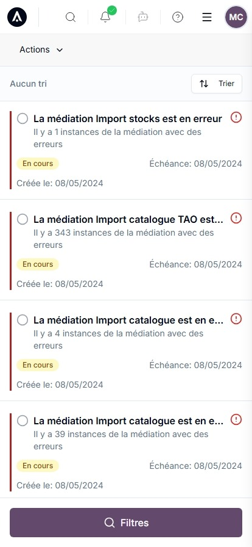
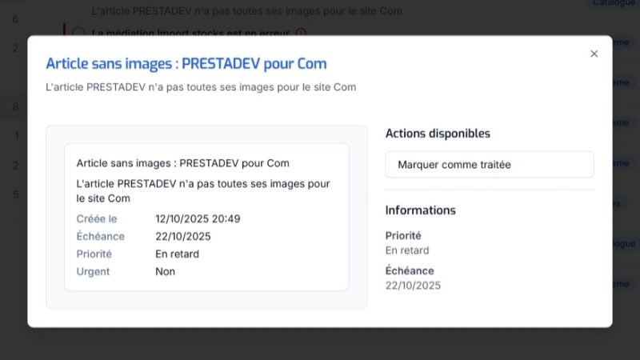

# Guide utilisateur – Mes tâches

## 🎯 Objectif
La page « Mes tâches » vous permet de visualiser, filtrer et gérer vos tâches en toute simplicité. Elle offre une vue claire de votre charge de travail, avec des outils pour prioriser et suivre l’avancement.

---

## 🖥️ Affichage des tâches

- **Vue desktop** : Tableau avec colonnes (titre, catégorie, échéance, actions).  
  

- **Vue mobile** : Cartes individuelles pour chaque tâche.  
  
  

- **Indicateurs visuels** :
  - ⭕ Tâche en cours
  - ✅ Tâche terminée
  - 🔴 Tâche urgente

- Les tâches terminées sont grisées et barrées.

---

## 📊 Informations affichées (desktop)

- **Tâche** : Titre + description
- **Catégorie** : Badge coloré (commandes, articles…)
- **Date d’échéance** : Rouge + icône si dépassée
- **Actions** : 👁️ pour consulter les détails

---

## 🔍 Filtrage

- **Bouton "Filtres"** en haut de page
- **Par urgence** : Toutes / Urgentes / Normales
- **Par catégorie** : Sélection multiple + compteur dynamique
- **Compteurs** : Mise à jour en temps réel

---

## ⚙️ Actions disponibles

- ⭕ → ✅ : Marquer comme terminé
- ✅ → ⭕ : Réactiver une tâche
- 👁️ ou double-clic : Voir les détails  
  

---

## 🧠 Comportement

- Actualisation automatique à la réouverture de l’onglet
- Sauvegarde immédiate des changements
- Navigation vers d’autres pages depuis les détails

---

## ⚠️ Points d’attention

- **Retard** : Date rouge + icône
- **Filtres** : Réinitialisés à chaque visite
- **Actions irréversibles** dans certains cas
- **Connexion** : Nécessaire pour synchroniser

---

## ✅ Bonnes pratiques

- Consulter la page chaque jour
- Prioriser les tâches urgentes
- Traiter par catégorie pour gagner du temps
- Surveiller les échéances

---

## 🔁 Workflow recommandé
### 🗓️ Traitement quotidien des tâches
Ce processus vous aide à garder le contrôle sur votre charge de travail au jour le jour.

1. **Consultation initiale** : Ouvrez la page pour voir toutes les tâches.
2. **Identification des priorités** : Activez le filtre « Urgentes » pour traiter les tâches critiques.
3. **Traitement des urgences** : Consultez les détails 👁️, exécutez les actions, puis marquez comme terminé ⭕ → ✅.
4. **Traitement par catégorie** : Désactivez le filtre urgence, sélectionnez une catégorie, traitez les tâches similaires.
5. **Vérification finale** : Contrôlez les tâches en retard (dates rouges).

### 🧩 Gestion d’une tâche complexe
Utilisez ce processus pour les tâches qui nécessitent des actions dans d’autres outils.

1. Double-cliquez pour ouvrir les détails.
2. Lisez les informations contextuelles.
3. Cliquez sur « Ouvrir l’URL » si disponible.
4. Effectuez les modifications dans l’autre application.
5. Revenez et marquez la tâche comme terminée.

### 🧠 Organisation croisée par urgence et catégorie
Optimisez votre traitement en combinant priorités et types de tâches.

1. Consultez les compteurs dans les filtres.
2. Identifiez les catégories les plus chargées.
3. Combinez « Urgentes » + une catégorie.
4. Traitez chaque combinaison jusqu’à épuisement.
5